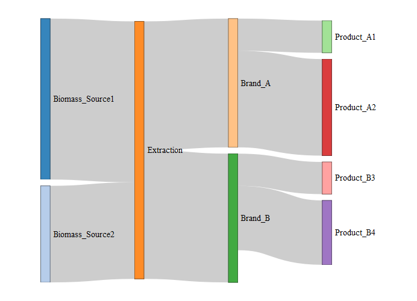

Sankey Chart for Extraction Process
================
Cody Flagg
5/9/2022

This is a very simple example of how a Sankey Chart can be used to
visualize the `flow` (quantity, mass etc.) between different `nodes`
(manufacturing steps, business entities etc.) in a process.

Here we imagine that we’re visualizing a single client that receives
biomass from two different sources. Biomass is extracted by the client
and then moved through a process into two different Brands (perhaps
“premium” vs “value”) with two different products each.

This chart is normally interactive in that a user can hover over the
different objects see numeric values and even drag the nodes around,
however active Javascript isn’t on GitHub pages.

**Chart is below the following code block.**

``` r
library(networkD3)
library(dplyr)

links2 <- data.frame(
source = c('Biomass_Source1', 
           'Biomass_Source2', 
           'Extraction', 
           'Extraction', 
           'Brand_A', 
           'Brand_A', 
           'Brand_B', 
           'Brand_B'),
target = c('Extraction', 
           'Extraction', 
           'Brand_A', 
           'Brand_B', 
           'Product_A1', 
           'Product_A2', 
           'Product_B3', 
           'Product_B4'),
# random numbers that represent flows - can pretend this is mass/quantity/revenue etc.
value = c(5, 3, 4, 4, 1, 3, 1, 2)
)

# extract unique names of nodes
nodes2 <- data.frame(
  name=c(as.character(links2$source), 
  as.character(links2$target)) %>% unique()
)

# assign integer index values for source and target nodes (i.e. chart coordinates)
## javascript indexes off 0, so subtract by 1
links2$IDsource <- match(links2$source, nodes2$name)-1 
links2$IDtarget <- match(links2$target, nodes2$name)-1

p <- sankeyNetwork(Links = links2, 
                   Nodes = nodes2,
                   Source = "IDsource", 
                   Target = "IDtarget",
                   Value = "value", 
                   NodeID = "name", 
                   units = 'kilograms',
              sinksRight=FALSE,
              fontSize = 13)
p
```

<!-- -->
